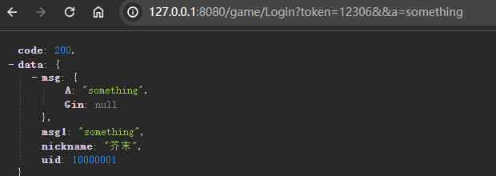

<div align="center">
<br/>
<br/>
  <h1 align="center">
    AutoRoute
  </h1>
</div>

#### 项目简介
>  Gin框架的路由中间件
>  极速创建 极速开发
>  致力于接口开发尽可能少的修改文件
>  纵享丝滑


#### 运行项目

``` gameHandler.go
import (
	"github.com/odinZzzzz/autoRoute"
	"github.com/gin-gonic/gin"
)

type gameHandler struct {
	autoRoute.AutoHandler
}
type paramDefine struct {
	A string `json:"a"`
}

func (c gameHandler) Login(msg map[string]interface{}) interface{} {
	loginParam := autoRoute.FormatParam(msg, paramDefine{})
	//参数中会注入gin.Context 置空后返回
	loginParam.Gin = nil
	return c.Suc(gin.H{
		"uid":      10000001,
		"nickname": "芥末",
		"msg":      loginParam,
		"msg1":     loginParam.A,
	})
}
```
- 1 query参数a会自动匹配到大写A的struct属性中 
- 2 token 为示例中HandlerPre 接口的透参
- 3 接口 127.0.0.1:8080/game/Login?token=12306&&a=123
- query 和 raw 合并在了msg的map里

```bash
go mod tidy
go run main.go
```
