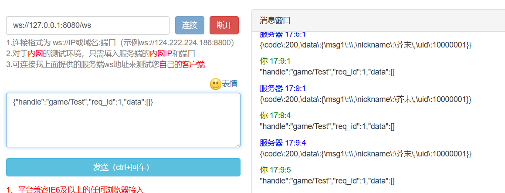

<div align="center">
<br/>
<br/>
  <h1 align="center">
    AutoRoute
  </h1>
</div>

#### 项目简介
>  Gin框架的路由中间件
>  极速创建 极速开发
>  致力于接口开发尽可能少的修改文件
>  纵享丝滑


#### 运行项目

``` gameHandler.go
package handler

import (
	"github.com/gin-gonic/gin"
	"github.com/odinZzzzz/autoRoute"
)

type gameHandler struct {
	autoRoute.AutoHandler
}

// 接口预处理函数 如果入参 不携带指定参数就拒绝访问
func (c gameHandler) HandlerPre(msg map[string]interface{}) bool {
	checkRes := true
	if msg["token"] != "12306" {
		checkRes = false
	}
	return checkRes
}

func (c gameHandler) Login(msg *game.LoginDefine) interface{} {

	return c.Suc(map[string]any{
		"uid":      10000001,
		"nickname": "芥末",
		"msg1":     msg.A,
	})
}

```
- 1 query参数a会自动匹配到大写A的struct属性中 
- 2 token 为示例中HandlerPre 接口的透参
- 3 接口 127.0.0.1:8080/game/Login?token=12306&&a=123
- 4 query 和 raw 合并在了msg的map里
- 5 全新的proto动态解析功能

-6 兼容websocket长链接口

- 
```bash
go mod tidy
go run main.go
```
